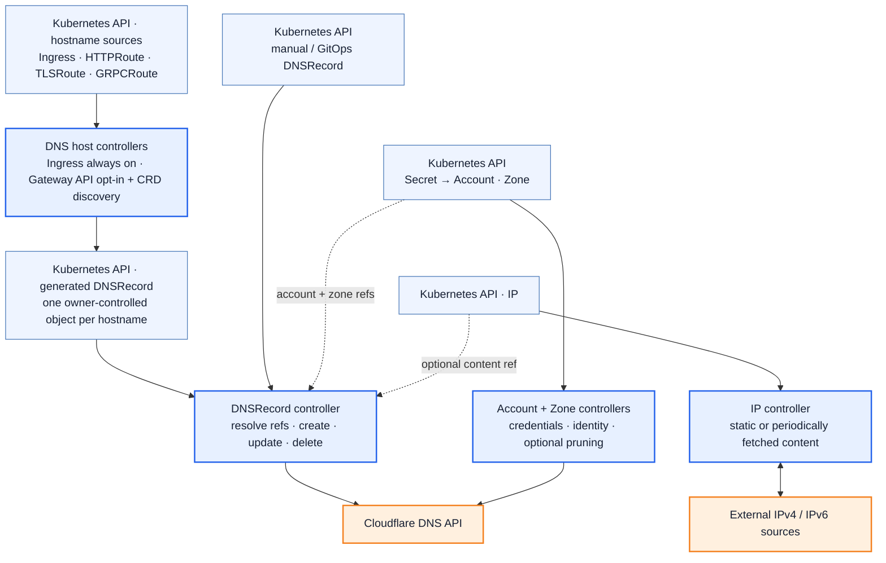

## Architecture

cloudflare-operator uses the Kubernetes API as the source of truth for Cloudflare DNS records. Desired state is stored in custom resources and can also be derived from Kubernetes Ingress and Gateway API route objects.

The Account and Zone controllers establish the Cloudflare scope, while the IP controller maintains reusable static or dynamic content. The Ingress controller and the opt-in Gateway API controllers translate hostnames and annotations into owner-controlled DNSRecord objects. The DNSRecord controller then resolves the referenced Account, Zone, and IP resources before applying the record to Cloudflare.

Gateway API support is enabled with `--enable-gateway-api`. At startup, the operator discovers the installed `HTTPRoute`, `TLSRoute`, and `GRPCRoute` CRDs and starts a controller for each supported kind it finds.

## DNS records

Cloudflare DNS records are specified using a CRD (`dnsrecords.cloudflare-operator.io`).\
These records can be created manually, through a GitOps workflow, or automatically generated from Kubernetes Ingress resources and supported Gateway API routes when the feature flag is enabled. Each generated DNSRecord is created in the source object's namespace and is owned by that source.

The Kubernetes API serves as the "single source of truth" for all zones in the configured Cloudflare account.

For more information on creating and using DNS records, please refer to the [DNSRecords documentation](/docs/cloudflare-operator/resources/dnsrecord).

## Accounts and zones

Account resources hold Cloudflare API credentials. If there is exactly one Account in the cluster, Zone and DNSRecord resources can omit `spec.accountRef` and the operator will use that Account automatically.

When you configure multiple Accounts, set `spec.accountRef.name` on each Zone. DNSRecords use the Account from their matching Zone. A DNSRecord can also set `spec.accountRef.name` directly, but it must match the Zone account when the Zone has one.

For Ingress and Gateway API route automation, use the `cloudflare-operator.io/account-ref` annotation when records should be created through a specific Account.

## IP objects

IP objects can be utilized to follow the "don't repeat yourself" (DRY) principle.

DNS records can be configured to use an IP object as the target content.\
If the IP object is updated, all DNS records that use it will be updated automatically.

The effective IP can either be configured in the IP object, or it can be dynamically fetched from the internet.\
This enables you to use cloudflare-operator as a dynamic DNS controller.

## Reconciliation

Reconciliation is the process of ensuring that the state of the cluster aligns with the desired state.

This process also incorporates "self-healing" by retrying failed operations after a specified interval.

Deleting an Ingress or supported Gateway API route stops the controller from creating new DNSRecord objects. Kubernetes owner references remove the generated objects, and their finalizers coordinate deletion of the corresponding Cloudflare records.
